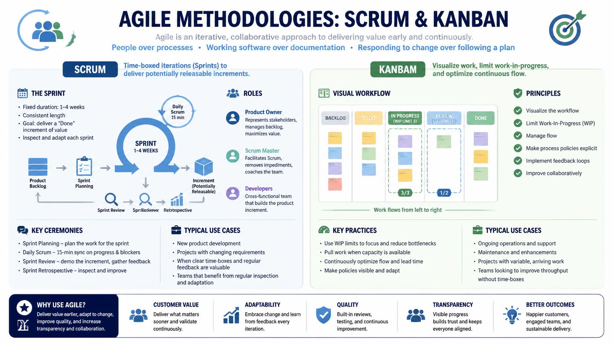
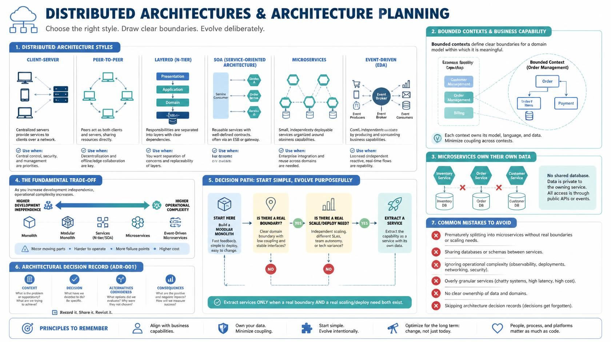

<!-- HU-STATUS TEMPLATE - do NOT remove the <!-- ... --> markers or the table headers.
     Your weekly grade is read AUTOMATICALLY from this file:
       02-week/hu-status/README.md  (inside YOUR fork). English. -->

# Weekly Status - Week 02

<!-- CONFIG-START - must match your profile repo (username/username) CONFIG -->
- FULL_NAME: Nicolas Obregon Rojas
- GITHUB_USER: nicolas1250
- TEAM: CineSync Platform
- SPRINT_GOAL: summary session 1 and 2, week 2 and methods agiles scrum and kanvan.
<!-- CONFIG-END -->

## 1. User stories worked this week

| HU ID | Title | Status (todo/doing/done) | Evidence (PR or commit URL) |
|---|---|---|---|
| HU-002-001 | Design of an infographic in English about distributed architectures, comparing client-server, P2P, SOA, and microservices, together with architectural planning and ADR. | done | N/A |
| HU-002-002 | Design of an infographic in English about Agile methodologies: Scrum & Kanban. | done | N/A |

## 2. My individual contribution

- Created an infographic in English about distributed architectures, including:
  - Client-server
  - Peer-to-peer (P2P)
  - Layered / N-tier
  - SOA
  - Microservices
  - Event-driven architecture
- Integrated key architectural concepts such as:
  - Bounded contexts
  - Architectural trade-offs
  - Designing microservices around business capabilities
  - The importance of documenting architectural decisions through an ADR
- Created a second infographic in English about **Agile Methodologies: Scrum & Kanban**.
- Organized the information in a visual format to make it clear, educational, and useful as supporting material.

## 3. Blockers and risks

- The Kanban board in GitHub Projects still needs to be completed.
- There is a risk of insufficient evidence if the corresponding PR or commit links are not added.
- If the board is not finalized, the weekly progress tracking may remain incomplete.

## 4. Plan for next week

- make big progress on the GitHub Projects kanban board
- Add the corresponding evidence for each user story, such as:
  - PR
  - Commit
  - Link to the completed work
- Continue documenting progress using the user story format and keep all deliverables organized.
- If time allows, improve the visual presentation of the submitted evidence and infographics.

## 5. Compliance self-check
- [ ] Conventional Commits - `type(scope): summary`
- [ ] Per-environment HU branch + PR to that environment (hu-xxx-dev -> develop, ...)
- [ ] Testable acceptance criteria
- [ ] Tests added/updated (unit / integration)
- [ ] DDD / hexagonal boundaries respected (domain has no I/O)
- [ ] No secrets; config via environment variables

## 6. Evidence links
 
 

