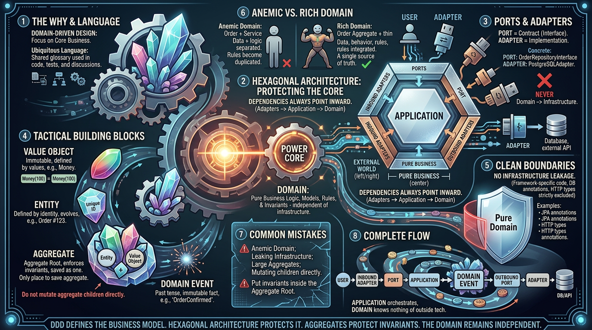

<!-- HU-STATUS TEMPLATE - do NOT remove the <!-- ... --> markers or the table headers.
     Your weekly grade is read AUTOMATICALLY from this file:
       03-week/hu-status/README.md  (inside YOUR fork). English. -->

# Weekly Status - Week 03

<!-- CONFIG-START - must match your profile repo (username/username) CONFIG -->
- FULL_NAME: Nicolas Obregon Rojas
- GITHUB_USER: nicolas1250
- TEAM: CineSync Platform
- SPRINT_GOAL: Define CineSync’s documentation and architecture using CSP-Docs as the source of truth, based on DDD and Hexagonal Architecture.

<!-- CONFIG-END -->

## 1. User stories worked this week

| **HU ID** | **Title** | **Status (todo/doing/done)** | **Evidence (PR or commit URL)** |
|---|---|---|---|
| HU-003-001 | CineSync documentation and architecture definition | done | N/A |

## 2. My individual contribution

- I organized the CSP-Docs repository following a structured documentation model, including the main folders and templates required for project management.
- I established CSP-Docs as the central reference for maintaining consistent and accessible project information.
- I reviewed DDD concepts such as Entities, Value Objects, Aggregates, and Domain Events to support the platform's domain modeling.
- I analyzed Hexagonal Architecture to separate domain logic from application and infrastructure concerns.
- I evaluated service boundaries, data ownership, and communication patterns between the four CineSync microservices.

## 3. Blockers and risks

- Some documentation areas, especially context, domain, and architecture, still need to be completed with CineSync-specific information.
- An Architectural Decision Record (ADR) is still required to document and justify the division of the platform into four APIs.
- The service boundaries must remain clearly defined to avoid unwanted dependencies between microservices.
- Data ownership needs to be carefully managed to prevent shared-database dependencies and distributed monolith problems.

## 4. Plan for next week

- Complete the platform context and define the main domain terminology and concepts.
- Expand the domain documentation with the initial DDD models and relationships.
- Define the first OpenAPI contracts for communication between the services.
- Prepare the initial MVP user stories and identify the first vertical development slice.
- Begin implementing the selected service following Hexagonal Architecture principles.

## 5. Compliance self-check
- [ ] Conventional Commits - `type(scope): summary`
- [ ] Per-environment HU branch + PR to that environment (hu-xxx-dev -> develop, ...)
- [ ] Testable acceptance criteria
- [ ] Tests added/updated (unit / integration)
- [ ] DDD / hexagonal boundaries respected (domain has no I/O)
- [ ] No secrets; config via environment variables

## 6. Evidence links

