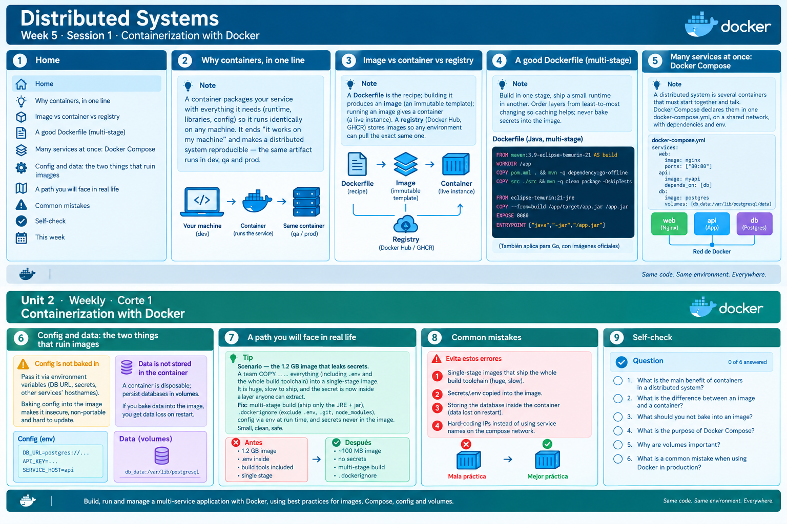

<!-- HU-STATUS TEMPLATE - do NOT remove the <!-- ... --> markers or the table headers.
     Your weekly grade is read AUTOMATICALLY from this file:
       05-week/hu-status/README.md  (inside YOUR fork). English. -->

# Weekly Status - Week 05

<!-- CONFIG-START - must match your profile repo (username/username) CONFIG -->
- FULL_NAME: Nicolas Obregon Rojas
- GITHUB_USER: Nicolas1250
- TEAM: CineSync Platform
- SPRINT_GOAL: **Sprint Goal:** Make CSP's DevOps documentation (`10-devops/`) accurate and trustworthy — correct environment variables, ports, and URLs consistent with the approved architecture — so any developer can rely on it without guessing.
<!-- CONFIG-END -->

## 1. User stories worked this week
 
| HU ID | Title | Status (todo/doing/done) | Evidence (PR or commit URL) |
|---|---|---|---|
| HU-ARCH-003 | DevOps Environments, CI/CD and Local Readiness | doing | Issue: https://github.com/code-corhuila/csp-docs/issues/6  |
 
## 2. My individual contribution
 
- Reviewed `10-devops/` (`README.md`, `environments.md`, `ci-cd.md`, `local-setup.md`) against `00-governance`, `05-architecture`, `06-data`, `07-api`, and `09-microservices` to verify every variable, port, and URL documented matched what was approved in those sections.
- Fixed `.env.example`: raised `APP_AUTH_BCRYPT_ROUNDS` from 10 to 12, the real minimum defined in `security-policy.md`/`security-rules.md`.
- Fixed the JWKS URL references in `local-setup.md`, which used `/jwks` instead of `/api/v1/auth/jwks`, to match the pattern documented in the auth-service README and runbook.
- Reviewed the Week 5 course content (Containerization with Docker; Release — shipping MVP 1) and made a diagram summarizing it.
## 3. Blockers and risks
 
- **`docker-compose.yml` at the repo root is still pending.** `local-setup.md` assumes it exists to start PostgreSQL, MongoDB, Redis, and RabbitMQ, but it hasn't been created yet. This blocks running the local environment described in Scenario 3 of the HU end-to-end.
- The four API repositories (`csp-api-auth`, `csp-api-catalog`, `csp-api-booking`, `csp-api-notification`) don't live in `csp-docs`, so their Dockerfiles and commands (`go run`, `mvn spring-boot:run`, migrations) can't be verified from here — they remain documented but untested.
- The only pipeline that exists today is `board-sync.yml` (GitHub project board automation); everything else in `ci-cd.md` is still approved design, not a working implementation.
## 4. Plan for next week
 
- Create the `docker-compose.yml` at the root of `csp-docs` with the 4 infrastructure services (PostgreSQL, MongoDB, Redis, RabbitMQ) and healthchecks, to close Scenario 3 of the HU.
- Once at least one real service repository exists, test `local-setup.md` end-to-end (clone, start infrastructure, run the service, verify `/health` and `/health/ready`).
- Start implementing the first real pipeline (PR pipeline) for one service, following the design already documented in `ci-cd.md`.
- Once `11-quality/` starts, validate that the test stages declared in `ci-cd.md` match what ends up being implemented.

## 5. Compliance self-check
- [x] Conventional Commits - `type(scope): summary`
- [] Per-environment HU branch + PR to that environment (hu-xxx-dev -> develop, ...)
- [x] Testable acceptance criteria
- [ ] Tests added/updated (unit / integration)
- [x] DDD / hexagonal boundaries respected (domain has no I/O)
- [ ] No secrets; config via environment variables

## 6. Evidence links

