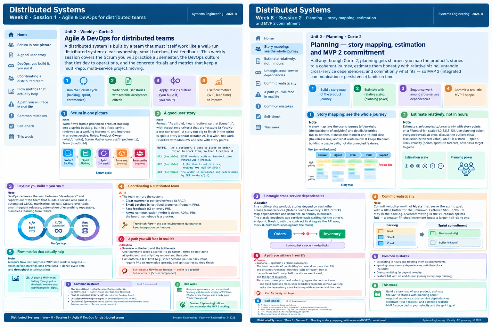

<!-- HU-STATUS TEMPLATE - do NOT remove the <!-- ... --> markers or the table headers.
     Your weekly grade is read AUTOMATICALLY from this file:
       08-week/hu-status/README.md  (inside YOUR fork). English. -->

# Weekly Status - Week 08

<!-- CONFIG-START - must match your profile repo (username/username) CONFIG -->
- FULL_NAME: nicolas obregon rojas
- GITHUB_USER: nicolas1250
- TEAM:CineSync Platform
- SPRINT_GOAL: Establish a consistent, reviewable architecture documentation baseline by proposing ADR-010 for microservice boundaries and UML traceability, aligning it with ADR-006 and ADR-009, and linking the decision to the `08-diagrams` and `09-microservices` documentation.
<!-- CONFIG-END -->

## 1. User stories worked this week

| HU ID | Title | Status (todo/doing/done) | Evidence (PR or commit URL) |
|---|---|---|---|
| HU-ARCH-001 | CineSync Architecture and Domain Diagrams | doing | [PR #26 — csp-docs](https://github.com/code-corhuila/csp-docs/pull/26) |

## 2. My individual contribution

- Authored and proposed **ADR-010: Microservices Boundaries and UML Traceability**.
- Updated the architecture decision register and index to preserve **ADR-009** for the diagram source format standard and register the microservices decision as ADR-010.
- Added ADR-010 governance references to the `08-diagrams` and `09-microservices` README files and the diagram index.
- Clarified how ADR-010's service data-ownership rules coexist with ADR-006's shared PostgreSQL instance per environment.

## 3. Blockers and risks

- ADR-010 is proposed and requires independent architecture review before acceptance.
- The microservices documentation and diagram index must remain consistent as service boundaries, data ownership, and diagrams evolve.
- This work was documentation-only; no code implementation or unit tests were added.

## 4. Plan for next week

- Address review feedback and obtain the required independent approval for ADR-010.
- Verify that the ADR registry, architecture indexes, and diagram traceability references remain aligned.
- Update the PR documentation and related architecture records if further changes are requested.

## 5. Compliance self-check

- Conventional Commits - `type(scope): summary`
- Per-environment HU branch + PR to that environment (`hu-xxx-dev -> develop`, ...). Not applicable to this documentation repository; this change uses `docs/* -> main`.
- Testable acceptance criteria - diagram identifiers, artifact paths, and requirement links are defined.
- Tests added/updated (unit / integration). Not applicable; this week's changes were documentation-only.
- DDD / hexagonal boundaries respected (domain has no I/O). No application code was changed.
- No secrets; config via environment variables. No secrets or configuration changes were introduced.

## 6. Evidence links

- [PR #26 — ADR-010 microservices and UML traceability](https://github.com/code-corhuila/csp-docs/pull/26)
- [Files changed in PR #26](https://github.com/code-corhuila/csp-docs/pull/26/files)
- [csp-docs repository](https://github.com/code-corhuila/csp-docs)
- 
