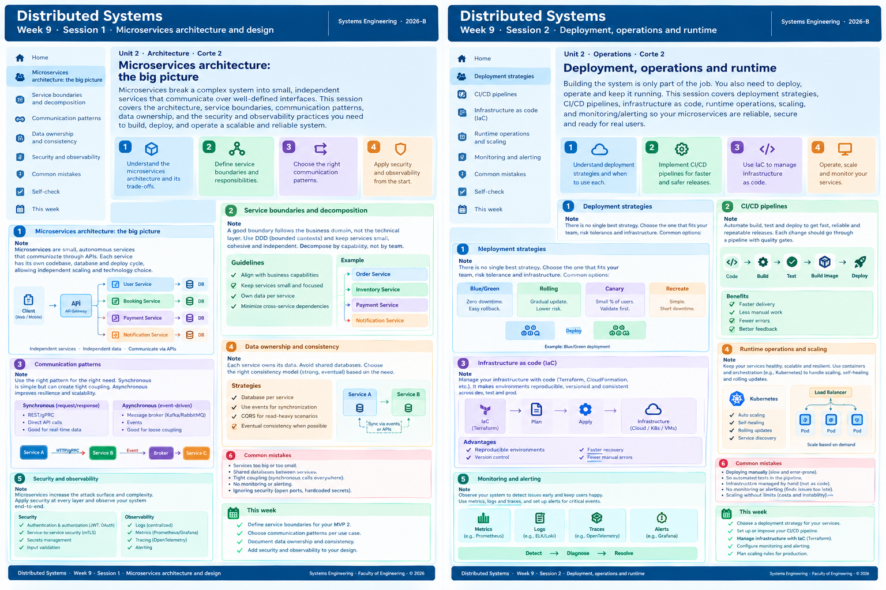

<!-- HU-STATUS TEMPLATE - do NOT remove the <!-- ... --> markers or the table headers.
     Your weekly grade is read AUTOMATICALLY from this file:
       09-week/hu-status/README.md  (inside YOUR fork). English. -->

# Weekly Status - Week 09

<!-- CONFIG-START - must match your profile repo (username/username) CONFIG -->
- FULL_NAME: Nicolas Obregon Rojas
- GITHUB_USER: nicolas1250
- TEAM: CineSync Platform
- SPRINT_GOAL: Consolidate Cut 2 requirements traceability by aligning user stories, functional requirements, the FR–HU traceability matrix, product backlog, and navigation map, while documenting which frontend flows use synthetic data and which integrate with `csp-booking-api`.
<!-- CONFIG-END -->

## 1. User stories worked this week

> Status describes the documentation work recorded in this PR series; it does not mean the corresponding application features have been implemented or released.

| HU ID | Title | Status (todo/doing/done) | Evidence (PR or commit URL) |
|---|---|---|---|
| HU-CATALOG-007 | Admin Views Sales and Occupancy Reports (descoped from the MVP) | done | [PR #53](https://github.com/code-corhuila/csp-docs/pull/53) |
| HU-AUTH-006 | Auth service story organization and functional-requirement traceability | done | [PR #55](https://github.com/code-corhuila/csp-docs/pull/55) |
| HU-CATALOG-006 | Catalog service story organization and functional-requirement traceability | done | [PR #55](https://github.com/code-corhuila/csp-docs/pull/55) |
| HU-BOOKING-001 | Refine Booking hold scope and document Cut 2 behavior | done | [PR #56](https://github.com/code-corhuila/csp-docs/pull/56) |
| HU-BOOKING-002 | Document technical notes for hold expiration | done | [PR #57](https://github.com/code-corhuila/csp-docs/pull/57) |
| HU-BOOKING-003 | Document technical notes for reservation confirmation | done | [PR #58](https://github.com/code-corhuila/csp-docs/pull/58) |
| HU-FE-CATALOG-001 | Frontend Catalog Renders Synthetic Data | done | [PR #59](https://github.com/code-corhuila/csp-docs/pull/59) |
| HU-FE-BOOKING-001 | Frontend Booking Integrates the Real Booking API | done | [PR #60](https://github.com/code-corhuila/csp-docs/pull/60) |
| HU-FE-CONCESSIONS-001 | Frontend Concessions Renders Synthetic Data | done | [PR #61](https://github.com/code-corhuila/csp-docs/pull/61) |
| HU-FE-TICKETING-001 | Frontend Ticket Renders Synthetic Data | done | [PR #62](https://github.com/code-corhuila/csp-docs/pull/62) |
| HU-FE-AUTH-001 | Frontend Auth Renders Synthetic Users | done | [PR #63](https://github.com/code-corhuila/csp-docs/pull/63) |
| HU-CONCESSIONS-006 | Concessions story backlog and requirements traceability | done | [PR #66](https://github.com/code-corhuila/csp-docs/pull/66) |
| HU-CONCESSIONS-007 | Concessions story backlog and requirements traceability | done | [PR #66](https://github.com/code-corhuila/csp-docs/pull/66) |
| HU-TICKETING-005 | Ticketing story backlog and requirements traceability | done | [PR #66](https://github.com/code-corhuila/csp-docs/pull/66) |

## 2. My individual contribution

### Requirements and backlog documentation

- Updated the backlog documentation in a sequence of 15 Pull Requests (#53–#67), keeping story changes, functional requirements, traceability, and UX route references reviewable in focused increments.
- Removed HU-CATALOG-007 from the MVP backlog after it was descoped.
- Refined and documented the scope of HU-BOOKING-001, HU-BOOKING-002, and HU-BOOKING-003 for the Cut 2 Booking flow.
- Added and documented the five Cut 2 frontend portal stories for Auth, Catalog, Booking, Concessions, and Ticketing.
- Added functional-requirement and traceability-matrix entries for backend and frontend stories, then synchronized the product backlog with the Cut 2 scope.
- Tagged the navigation map with the relevant frontend HUs and documented which flows use synthetic data versus the real Booking API.
- Corrected the Core Service Implementation artifact wording from MongoDB/Mongock to MongoDB/Liquibase while updating the navigation documentation.
- Reviewed PR descriptions and verification checklists against the actual diffs, and prepared review responses when scope, counts, or supporting references did not match.
- PR #54, which proposed reorganizing Concessions stories and refreshing counters, was closed without being merged. It is recorded as part of the PR history, not as an integrated change.

### Validation performed

- Checked story identifiers, backlog counts, FR-to-HU mappings, and the presence of all five frontend stories in the traceability matrix.
- Compared PR descriptions and verification checklists with the current PR diffs, correcting stale assumptions in review discussions.
- Used documentation diffs and repository references for validation. This PR series did not add or update application unit or integration tests.

## 3. Blockers and risks

- The work is documentation-only; the stories and contracts described here still require implementation and runtime verification before the corresponding features can be considered delivered.
- PR #54 was closed without merge. Its Concessions reorganization should not be treated as integrated unless the team confirms that a later change superseded it.
- A prior review of the Booking technical notes in PR #57 found an ADR reference and implementation details that were not verifiable in the repository at that time. Confirm the authoritative architecture decision and supporting standard before using those notes as implementation guidance.
- The frontend FR identifiers use a cross-cutting `FR-FE-*` series while the related HUs retain domain identifiers. Their one-to-one traceability is documented, but the naming convention should remain explicit and consistent in future requirements.
- The user-story and backlog documentation does not itself demonstrate that the corresponding frontend flows, Booking API integration, or acceptance scenarios pass in a running system.

## 4. Plan for next week

- Reconcile the closed, unmerged PR #54 with the current `main` branch and confirm whether any of its intended Concessions organization changes remain necessary.
- Verify the Booking technical notes against an approved ADR and the current service/API documentation; update or remove unsupported references through the appropriate review process.
- Perform a final consistency pass across `user-stories.md`, `functional.md`, `traceability-matrix.md`, `product-backlog.md`, and `navigation-map.md`.
- Coordinate implementation owners for the Cut 2 frontend and Booking stories, and agree on test evidence needed to validate the documented acceptance criteria.
- Keep future documentation changes small, traceable, and supported by accurate PR descriptions and verification checklists.

## 5. Compliance self-check

- [x] Conventional Commits - `type(scope): summary`
- [ ] Per-environment HU branch + PR to that environment (hu-xxx-dev -> develop, ...)
- [x] Testable acceptance criteria
- [ ] Tests added/updated (unit / integration)
- [ ] DDD / hexagonal boundaries respected (domain has no I/O)
- [x] No secrets; config via environment variables

> The per-environment branch, test, and DDD checks are not claimed as completed: this was a documentation-only PR series, not an application implementation. No secrets or runtime configuration were added or changed.

## 6. Evidence links

The table above lists the primary PR for each story-level change. The following PRs provide shared, cross-cutting evidence for functional requirements, traceability, backlog alignment, and navigation:

- **Shared requirements and traceability:** [PR #64](https://github.com/code-corhuila/csp-docs/pull/64) and [PR #65](https://github.com/code-corhuila/csp-docs/pull/65).
- **Shared backlog and navigation updates:** [PR #66](https://github.com/code-corhuila/csp-docs/pull/66) and [PR #67](https://github.com/code-corhuila/csp-docs/pull/67).

- **PR-01:** [#53 — Remove HU-CATALOG-007](https://github.com/code-corhuila/csp-docs/pull/53)
- **PR-02:** [#54 — Reorganize Concessions stories](https://github.com/code-corhuila/csp-docs/pull/54) — closed without merge.
- **PR-03:** [#55 — Reorder Auth and Catalog stories](https://github.com/code-corhuila/csp-docs/pull/55)
- **PR-04–06:** [#56 — HU-BOOKING-001](https://github.com/code-corhuila/csp-docs/pull/56), [#57 — HU-BOOKING-002](https://github.com/code-corhuila/csp-docs/pull/57), [#58 — HU-BOOKING-003](https://github.com/code-corhuila/csp-docs/pull/58)
- **PR-07–11:** [#59 — Catalog frontend](https://github.com/code-corhuila/csp-docs/pull/59), [#60 — Booking frontend](https://github.com/code-corhuila/csp-docs/pull/60), [#61 — Concessions frontend](https://github.com/code-corhuila/csp-docs/pull/61), [#62 — Ticketing frontend](https://github.com/code-corhuila/csp-docs/pull/62), [#63 — Auth frontend](https://github.com/code-corhuila/csp-docs/pull/63)
- **PR-12–15:** [#64 — Functional requirements](https://github.com/code-corhuila/csp-docs/pull/64), [#65 — Traceability matrix](https://github.com/code-corhuila/csp-docs/pull/65), [#66 — Product backlog](https://github.com/code-corhuila/csp-docs/pull/66), [#67 — Navigation map](https://github.com/code-corhuila/csp-docs/pull/67)

### Week summary

The 15-PR sequence documented the Cut 2 backlog from story-level scope through functional requirements, traceability, product planning, and UX navigation. It removed a descoped Catalog story, refined the Booking documentation, added the five frontend portal stories, and connected those stories to their FRs and routes. The work establishes a traceable documentation baseline; it does not claim that the described features have been implemented or tested in the applications.

